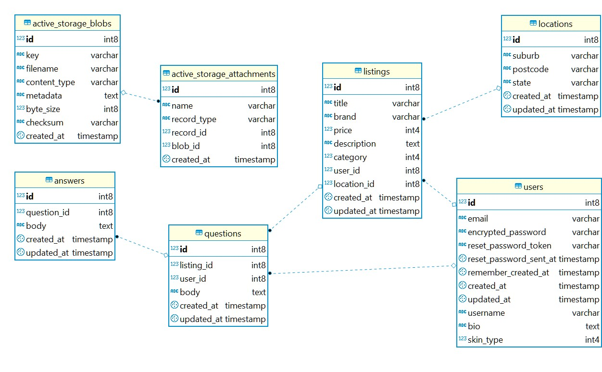

## Rails Marketplace: Aussie Beauty Market

Aussie Beauty Market (ABM) is a two-sided Rails marketplace application that allows people to buy and sell second-hand makeup in Australia.

## Links

- __[R9] Live Website__:
- __[R10] GitHub Repo__: https://github.com/EllieChen-Git/Aussie-Beauty-Market

<!-- ## [R7][R8] Problem Identification & Solution -->
<!-- 
Identification of the problem you are trying to solve by building this particular marketplace app.)
Why is it a problem that needs solving?

In a consumer society, so many new products are launched every single day. Nowadays, many people own stuffs either they do not like anymore or they will not be using in the near future. Makeups are no exception! Therefore, ABM is specifically developed to tackle this problem that the Australian beauty industry is facing. 

ABM is a two-sided marketplace application where people can sell and buy second-hand makeup in Australia. It does not only serve as a second-hand makeup marketplace, but also help us reduce the waste and do our bit to protect the environment. I am also hoping that this app can build a platform for people in Australia to share their views on makeups and find the products that suit them personally based on the product information listed and the user profile provided on the website. 

Before starting this project, I researched on the existing websites on the market. When it comes to selling goods, the first idea comes to people's mind would be websites like Gumtree, eBay and Amazon. However, these websites do not only focus on makeups and are not intended for building a beauty community. Therefore, the target audience would be different from ABM. 

Many social platforms also provide a similar functionality (i.e. online forum) for people to sell makeups. For example, there is a social group 'MAKEUP BUY, SELL, GIVEAWAY AND SWAP AUSTRALIA AND NEW ZEALAND (https://www.facebook.com/groups/894975940585690/)' on Facebook. The drawbacks of this kind of marketplace on social platform is that people must have Facebook accounts in order to use this service. As many people use Facebook to share their personal lives with their family and friends, there are many sensitive personal information on their Facebook profile. Some people (like me) are hesitated to use Facebook groups to buy and sell goods as we are afraid that our personal information will be comprised without our acknowledgment.

There is another website called Glambot (https://www.glambot.com/) on the market. However, this is not a direct two-sided marketplace as buyers and sellers cannot trade with each other directly. This website servers as a medium to firstly collect used makeups from sellers (they pay the sellers), and re-sell the products to product buyers.  

The only similar website 'r/aussiemakeupexchange' was shut down few years ago.

Similar websites
1.	Glambot (https://www.glambot.com/): ‘we are changing the way that the beauty industry works, now people, brands, and vloggers can sell their makeup to us with our 100% confidential process and receive $$ on the spot for their goodies. We then professionally sanitize everything and package it for sale on our site’
•	Glambot serves as a medium (they buy makeups, clean them, and sell them to people)
2.	Facebook group - MAKEUP BUY, SELL, GIVEAWAY AND SWAP AUSTRALIA AND NEW ZEALAND (https://www.facebook.com/groups/894975940585690/)
•	People need to have a fb account & log into their account: privacy
3.	Gumtree/eBay: not only for makeup
4.	r/aussiemakeupexchange: shut down

-->

<!-- ## [R11] Project Description -->

<!--
Purpose: Aussie Beauty Market - Where you can buy and sell 2nd hand makeup in Australia
1.	Only for makeups
2.	Only for Aussies
3.	People can trade makeups from each other directly
4.	User can create their own profile (skin type, preferred makeup style, the beauty youtubers they follow): people can see the products from people with the same skin type (& the same makeup tastes) with them
5.	Buyers and sellers can give comment to each other for every transaction
6.	People can ask questions before purchasing 

-->

<!-- #### Purpose
#### Functionality / Features -->

<!-- [R4]Your app will have authorisation (i.e. users have restrictions on what they can see and edit). 
[O4] Searching, sorting and/or filtering capability.-->

<!-- #### Sitemap -->
<!-- The sitemap of the marketplace can also be viewed on GitHub: [Marketplace - Sitemap]() -->

<!-- #### Screenshots
#### Target Audience
#### Tech Stack

- Programming languages: Ruby on Rails, JavaScript, HTML, CSS, SASS
- Source control: Git & GitHub
- Planning & implementation: 1. project management (Trello), 2. mood board (Pinterest), 3. wireframe (Balsamiq)
- Deployment platform: Heroku 
- Payment processing: Stripe
- Cloud storage: AWS - S3
- Security: AWS - IAM

## System Dependencies -->
<!-- Detail any third-party services that your app will use
[briefly describe how to install & briefly describe what each gem does. can copy from gem description] -->

#### Ruby gems
- __[R3] Devise__ (https://rubygems.org/gems/devise): Devise helps with easier authentication process with Rails.

- __Faker__ (https://rubygems.org/gems/faker/versions/1.6.3): Faker is gem that helps people to generate fake data, like names, addresses, emails, etc.

- __Httparty__ (https://rubygems.org/gems/httparty): Httparty is gem that allows people to write Ruby code to retrieve http response.

- __Simple form (https://rubygems.org/gems/simple_form/versions/3.5.0)__: Simple Form is a gem that helps to smooth the Rails form generating process.

- __Ultrahook__
- __Down__

#### [O2] Third-party API
- __Postcode API__ (https://postcodeapi.com.au/): Postcode API is a free service that allows anyone to easily lookup Australian suburbs and postcodes based on various criteria.

#### [R16] Third-party Service
- __[R6] Heroku__
- __[O1] Stripe__
- __[R5] AWS - S3__
- __AWS - IAM__

## Design Brief

#### Colour Scheme

https://color.adobe.com/search?q=autumn

#### Mood board

Mood board for this site can also be found on Pinterest: [Marketplace - Mood Board](https://www.pinterest.com.au/elliechenetc/abm/)

<!-- #### [R12] User Stories -->

#### [R13] Wireframes

[!Marketplace - Wireframes]()

<!-- [挑一下6-8張，3個螢幕size的就好，不要每一頁都截圖。重點挑有listings的，因為只有那幾張才有大變化XD]
The complete wireframes (9 pages for 3 different screen sizes: desktop, tablet & mobile) of the marketplace can also be viewed on GitHub: [Marketplace - Wireframes]() -->

## [R20] Project Management & Timeline
<!-- Describe the way tasks are allocated and tracked in your project
(too many days, probably a screenshot for every 3 days) -->

Trello board for this site can be found here: [Marketplace - Project Management](https://trello.com/b/YCQRqyra/marketplace-abm)

__25-Oct | Day 1 Project Design__ 
- Project idea approved
- Completed wireframes (desktop & mobile)
- Drafted ERD
- Drafted README

__26-Oct | Day 2 Project Design & Research__ (refer to Trello screenshots)
- Updated README format
- Developed project plan
- Set up Trello board
- Completed wireframes (tablet)

__27-Oct | Day 3 Project Design & Research__ 
- Reviewed Rails concepts (database, Devise, Stripe)
- Created project development flow

__28-Oct | Day 4 Backend Coding & Database Testing__
- Set up database (80% - 'Transactions' table to do)
- Set up associations in Models
- Completed simple database testing in Rails console
- Added normalize CSS
- Completed seeds file (80% - 'Q&A' to do)

__29-Oct | Day 5 Backend Coding & Frontend Design__ 
- Scrapped the project & rebuilt it from scratch
- Worked out relationship between routes/views/controllers for all the webpages
- Decided colour scheme & tested (by creating _variables.scss & 5 divs in index.html.erb)
- Completed moodboard (Pinterest)
- Decided fonts: 1 special font(Gochi Hand), regular font(Roboto, Source Sans Pro)  
- Completed HTML/CSS layout design

__30-Oct | Day 6 Backend Coding & Frontend Design__ [Plan]

- Redo Listings (all routes, all methods in controller, all views), decided to use simple form or not
- Create partial html component (nav)
- Create partial html component (footer)
- Modify sign up, log in, forgot password pages (originally created by Devise)

__31-Oct | Day 7 Frontend Design__ (refer to Trello screenshots)

__01-Nov | Day 8 Frontend Coding__ 

__02-Nov | Day 9 Frontend Coding__ 

__03-Nov | Day 10 Frontend Coding__

__04-Nov | Day 11 Frontend Coding__

__05-Nov | Day 12 Payment setup & deployment__ (refer to Trello screenshots)

__06-Nov | Day 13 Payment setup & deployment__

__07-Nov | Day 14 Documentation__

__08-Nov | Day 15 Documentation__
<!-- !! Fix all the major issues (basically do not change any code after this day) -->

__09-Nov | Day 16 Presentation Preparation__ (refer to Trello screenshots)
<!-- !! Last day of actual coding (only fix minor coding issues) -->

__10-Nov | Day 17 Final Check__
<!-- Final check: spelling check on README, spelling check on code comment (html/CSS), all images need to have alt text, accessibility test
slides & presentation preparation 
Submission (2200 Due) -->

## Database Planning & Structure

#### [R14] ERD (80% completed)
1. will do 'transactions' table after implementing Stripe, 
2. will add notation after 'transactions' table)

<!-- can use Ruby gem (the format is different from what we learnt)
    https://rubygems.org/gems/rails-erd
    https://github.com/voormedia/rails-erd

or export tables from DBeaver & draw lines: https://github.com/dbeaver/dbeaver/wiki/ER-Diagrams

Wayne: https://www.lucidchart.com/

Ricky: StarUML

Users 
•	Id – integer (automatically created)
•	Username: string 
•	Email: string
•	encrypted_password: encrypted???
•	Bio: text
•	Skin_type: integer (enum: 0 Oily, 1 Normal, 2 Dry, 3 Combo)

Listings 
•	Id – integer (automatically created)
•	Title: string [search]
•	Brand: string [search]
•	Price: integer (cents) [filter]
•	Description: text
•	category: integer (enum: 0 face, 1 eyes , 2 lips , 3 accessories) [filter]
•	User_id: references [clickable button]
•	Location_id: references [search]
Locations 
•	Id – integer (automatically created)
•	Suburb: string
•	Postcode: string
•	state: string [not using enum here: 0 ACT, 1 NSW, 2 NT, 3 QLD, 4 SA, 4TAS, 6 VIC, 7 WA]

Questions 
•	Id – integer (automatically created)
•	Listing_id: references
•	User_id: references
•	Body: text

Answers
•	Id – integer (automatically created)
•	Question_id: references
•	Body: text

Purchases
•	Id – integer (automatically created)
•	Listing_id: integer
•	User_id: integer
•	Stripe_id: string
•	Purchase_date: date
Active Storage (images)
•	Id – integer (automatically created)
•	Name: string
•	Record_type: string
•	Record_id: integer
•	Blob_id: integer -->

<!-- ####  [R15] High-level components (abstractions) -->
<!-- Explain the different high-level components (abstractions) in your app -->

<!-- ####  [R17] Projects Models & Relationships -->
<!-- Describe your projects models in terms of the relationships (active record associations) they have with each other -->

<!-- ####  [R18] Database -->
<!-- Discuss the database relations to be implemented in your application [remember to mention PostgreSQL R2]-->

<!-- ####  [R19] Database Schema Design -->
<!-- Provide your database schema design -->
---
## Future Improvements

Copyright © 2019 Ellie Chen. All Rights Reserved.
