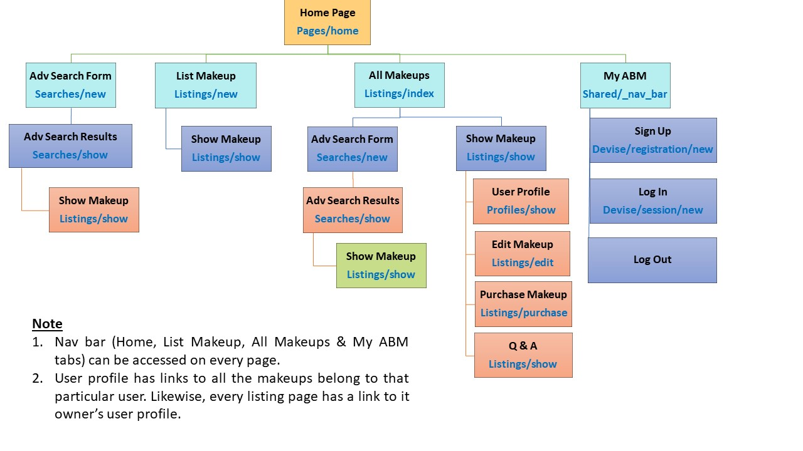

## Rails Marketplace: Aussie Beauty Market

Aussie Beauty Market (ABM) is a two-sided Rails marketplace application that allows people to buy and sell second-hand makeup in Australia.

## Links

- __[R9] Live Website__:
- __[R10] GitHub Repo__: https://github.com/EllieChen-Git/Aussie-Beauty-Market

<!-- ## [R7][R8] Problem Identification & Solution -->
<!-- 
Identification of the problem you are trying to solve by building this particular marketplace app.)
Why is it a problem that needs solving?

In a consumer society, so many new products are launched every single day. Nowadays, many people own stuffs either they do not like anymore or they will not be using in the near future. Makeups are no exception! Therefore, ABM is specifically developed to tackle this problem that the Australian beauty industry is facing. 

ABM is a two-sided marketplace application where people can sell and buy second-hand makeup in Australia. It does not only serve as a second-hand makeup marketplace, but also help us reduce the waste and do our bit to protect the environment. I am also hoping that this app can build a platform for people in Australia to share their views on makeups and find the products that suit them personally based on the product information listed and the user profile provided on the website. 

Before starting this project, I researched on the existing websites on the market. When it comes to selling goods, the first idea comes to people's mind would be websites like Gumtree, eBay and Amazon. However, these websites do not only focus on makeups and are not intended for building a beauty community. Therefore, the target audience would be different from ABM. 

Many social platforms also provide a similar functionality (i.e. online forum) for people to sell makeups. For example, there is a social group 'MAKEUP BUY, SELL, GIVEAWAY AND SWAP AUSTRALIA AND NEW ZEALAND (https://www.facebook.com/groups/894975940585690/)' on Facebook. The drawbacks of this kind of marketplace on social platform is that people must have Facebook accounts in order to use this service. As many people use Facebook to share their personal lives with their family and friends, there are many sensitive personal information on their Facebook profile. Some people (like me) are hesitated to use Facebook groups to buy and sell goods as we are afraid that our personal information will be comprised without our acknowledgment.

There is another website called Glambot (https://www.glambot.com/) on the market. However, this is not a direct two-sided marketplace as buyers and sellers cannot trade with each other directly. This website servers as a medium to firstly collect used makeups from sellers (they pay the sellers), and re-sell the products to product buyers.  

The only similar website 'r/aussiemakeupexchange' was shut down few years ago.

Similar websites
1.	Glambot (https://www.glambot.com/): ‘we are changing the way that the beauty industry works, now people, brands, and vloggers can sell their makeup to us with our 100% confidential process and receive $$ on the spot for their goodies. We then professionally sanitize everything and package it for sale on our site’
•	Glambot serves as a medium (they buy makeups, clean them, and sell them to people)
2.	Facebook group - MAKEUP BUY, SELL, GIVEAWAY AND SWAP AUSTRALIA AND NEW ZEALAND (https://www.facebook.com/groups/894975940585690/)
•	People need to have a fb account & log into their account: privacy
3.	Gumtree/eBay: not only for makeup
4.	r/aussiemakeupexchange: shut down

-->

<!-- ## [R11] Project Description -->

<!--
Purpose: Aussie Beauty Market - Where you can buy and sell 2nd hand makeup in Australia
1.	Only for makeups
2.	Only for Aussies
3.	People can trade makeups from each other directly
4.	User can create their own profile (skin type, preferred makeup style, the beauty youtubers they follow): people can see the products from people with the same skin type (& the same makeup tastes) with them
5.	People can ask questions before purchasing 

-->

<!-- #### Purpose
#### Functionality / Features -->

<!-- 
Your app will have authorisation (i.e. users have restrictions on what they can see and edit). 
[R4] User authorisation: new listing, edit, show, question, answer

CURD listings

Searching, sorting and/or filtering capability.
[O4] Simple search (listing title - fuzzy search & case insensitive) and advanced search (brands - fuzzy search & case insensitive, category, price point)

Responsive web design: Suits devices in different screen sizes with media breakpoints of 600px and 900px.

User profile: list all the makeups belong to the user
show listing can also check user profile

Different Sign Up/Log In/Log Out tabs will be shown depending on the user’s login status.

stripe/purchase function

Q&A section

-->

#### Sitemap

The sitemap of the marketplace can also be viewed on GitHub: [Marketplace - Sitemap](https://github.com/EllieChen-Git/Aussie-Beauty-Market/blob/master/docs/sitemap.jpg)

<!-- #### Screenshots
#### Target Audience-->
#### Tech Stack

- Programming languages: Ruby on Rails, JavaScript, HTML, CSS, SASS
- Source control: Git & GitHub
- Planning & implementation: 1. project management (Trello), 2. mood board (Pinterest), 3. wireframe (Balsamiq)
- Deployment platform: Heroku 
- Payment processing: Stripe
- Cloud storage: AWS - S3
- Security: AWS - IAM

## System Dependencies 
<!-- Detail any third-party services that your app will use
[briefly describe how to install & briefly describe what each gem does. can copy from gem description] -->

#### Ruby gems
- __[R3] Devise__ (https://rubygems.org/gems/devise): Devise is a flexible authentication solution for Rails based on Warden.

- __Faker__ (https://rubygems.org/gems/faker/versions/1.6.3): This gem is a port of Perl's Data::Faker library that generates fake data. It comes in very handy for taking screenshots, having real-looking test data, and having your database populated with more than one or two records while you're doing development.

- __Httparty__ (https://rubygems.org/gems/httparty): Makes http fun again! Ain't no party like a httparty, because a httparty don't stop.

- __Normalize-rails__ (https://rubygems.org/gems/normalize-rails): Normalize.css is an alternative to CSS resets.

- __Down__ (https://rubygems.org/gems/down/versions/1.1.0): Robust file download from URL using open-uri.

- __Aws-sdk-s3__ (https://rubygems.org/gems/aws-sdk-s3/versions/1.0.0.rc2): Official AWS Ruby gem for Amazon Simple Storage Service (Amazon S3). This gem is part of the AWS SDK for Ruby.

- __Stripe__ (https://rubygems.org/gems/stripe/versions/1.57.1): Stripe is the easiest way to accept payments online. See https://stripe.com for details.

- __Ultrahook__ (https://rubygems.org/gems/ultrahook): Ultrahook lets you receive webhooks on localhost. It relays HTTP POST requests sent from a public endpoint (provided by the ultrahook.com service) to private endpoints accessible from your computer.

<!-- - __PrettyUsers__ (https://rubygems.org/gems/prettyusers): Generate pretty users for your tests. -->
<!-- font-awesome-rails
https://rubygems.org/gems/font-awesome-rails/versions/4.6.3.1 -->

<!-- [PROBABLY WON'T USE IT] - __Simple form__ (https://rubygems.org/gems/simple_form/versions/3.5.0): Simple Form is a gem that helps to smooth the Rails form generating process. -->

#### [O2] Third-party API
- __Postcode API__ (https://postcodeapi.com.au/): Postcode API is a free service that allows anyone to easily lookup Australian suburbs and postcodes based on various criteria.
- __[to use?] Makeup API__ (https://makeup-api.herokuapp.com/): 
endpoint: http://makeup-api.herokuapp.com/api/v1/products.json
<!-- response = HTTParty.get("http://makeup-api.herokuapp.com/api/v1/products.json")
p response.parsed_response[0]["name"] -->

#### [R16] Third-party Service
- __[R6] Heroku__
- __[O1] Stripe__
- __[R5] AWS - S3__
- __AWS - IAM__

## Design Brief

#### Colour Scheme

Colour palette for this site can also be found on Adobe Color: [Marketplace - Colour Palette](https://color.adobe.com/search?q=autumn)

#### Mood board

Mood board for this site can also be found on Pinterest: [Marketplace - Mood Board](https://www.pinterest.com.au/elliechenetc/abm/)

<!-- #### [R12] User Stories -->

#### [R13] Wireframes

The completed wireframes (11 pages for 3 different screen sizes: desktop, tablet & mobile) of the marketplace can also be viewed on GitHub: [Marketplace - Wireframes]()

Below are the selective screenshots:

- Wireframes - 1. Landing (desktop & mobile)

[Marketplace - Wireframes](./docs/wireframes/wireframes_1.png)

- Wireframes - 2. Sign up (tablet)

- Wireframes - 5. User Profile (desktop & mobile)

- Wireframes - 6. All listings (desktop & mobile)

[Marketplace - Wireframes](./docs/wireframes/wireframes_6.png)

- Wireframes - 7. New Listing (desktop & mobile)

[Marketplace - Wireframes](./docs/wireframes/wireframes_7.png)

- Wireframes - 8. Show Listing (desktop & mobile)

- Wireframes - 9. Edit Listing (tablet)

[Marketplace - Wireframes](./docs/wireframes/wireframes_9.png)

- Wireframes - 10. New Advanced Search

## [R20] Project Management & Timeline

Trello board for this site can be found here: [Marketplace - Project Management](https://trello.com/b/YCQRqyra/marketplace-abm)

- Trello screenshot on 26 Oct 2019

- Trello screenshot on 31 Oct 2019

- Trello screenshot on 05 Nov 2019

- Trello screenshot on 09 Nov 2019

__25-Oct | Day 1 Project Design__ 
- Project idea approved
- Completed wireframes (desktop & mobile)
- Drafted ERD
- Drafted README

__26-Oct | Day 2 Project Design & Research__ (refer to Trello screenshots)
- Updated README format
- Developed project plan
- Set up Trello board
- Completed wireframes (tablet)

__27-Oct | Day 3 Project Design & Research__ 
- Reviewed Rails concepts (database, Devise, Stripe)
- Created project development flow

__28-Oct | Day 4 Backend Coding & Database Testing__
- Set up database (80% - 'Purchases' table to do)
- Set up associations in Models
- Completed simple database testing in Rails console
- Completed seeds file

__29-Oct | Day 5 Backend Coding & Frontend Design__ 
- Scrapped the whole project & rebuilt it from scratch
- Decided colour scheme & tested 
- Completed moodboard (Pinterest)
- Decided fonts: 1 special font (Gochi Hand), 2 regular fonts (Roboto, Source Sans Pro)  
- Completed HTML/CSS layout planning
- Completed all routes

__30-Oct | Day 6 Backend Coding__
- Added Gem (simple_form, normalize-rails, down), but later decided not to use simple_form
- Modified views: user_signup
- Added views: landing page, show_listing, new_listing, form_partial

__31-Oct | Day 7 Backend Coding__ (refer to Trello screenshots)
- Completed views: new_listing (nested_attributes_for: location), edit_listing, show_listing (incl. ‘delete’ button)
- Added wireframe: edit_listing
- Completed Q&A section on show_listing: Q&A routes, Q&A controllers, Q&A form_partial

__01-Nov | Day 8 Backend Coding__ 
- Completed user_profile page (route, profiles controller, show_profile view)
- Added links to user profile on show_listing & added links to individual listing on show_profile page
 master
- Modified user_signup (added user image uploading function), user_login, user_forgot_password pages
- Whitelisted & validated params for all fields in new_listing, question, answer
- Added user images to seeds file

__02-Nov | Day 9 Backend Coding__ 
- Completed simple search form (fuzzy search, case insensitive) on landing, all_listings, show_listing pages by creating simple search form partial & search method on listing model
- Completed advanced search function (search: routes, controller, model, views)
- Completed AWS S3 & IAM set up and switched images storage from local to cloud
- Set up Stripe & Buy function on show_listing: install gems (stripe, ultrahook), payments (routes, controller, successful_payment view)

__03-Nov | Day 10 Frontend Coding__
- Initial front-end setup: Imported font awesome, google fonts
- Added footer (copyright, social icon bar)
- Added nav bar (with log in/sign up or logout dropdown - based on login status)

__04-Nov | Day 11 Frontend Coding__
- fixed white space issue above nav bar by moving nav_bar partial into application.html.erb [later caused another spacing issue when added hero image]
- added icons to login/signup/logout
- set up class on simple_search partial form & styled it
- landing_page: set up basic RWD design & added hero image
- created Purchase model & associations in listing & user models

__05-Nov | Day 12 Frontend Coding__ (refer to Trello screenshots)
- fixed purchase table issues: modified webhook route in stripe, started ultrahook, purchase (route, controller, view) 
- fixed nav bar - dropdown (z-index)
- fixed white space issues (nav bar & footer)
- changed footer to be RWD
- changed nav bar to be collapsible & RWD
- completed ERD with notation & sitemap
- styled all_listing page

__06-Nov | Day 13 Frontend Coding (Styling )__
- implemented basic user authentication & authorisation
1. listings_controller: 
2. show_listing: only shows edit & delete buttons if user == owner
3. show_listing: only shows purchase button if listing hasn't been purchased
4. _questions_answer: only users != owner will see 'ask question' form 
5. _questions_answer: only users == owner will see 'answer question' form 
- styled new_listing, edit_listing (basic)
- modified  wireframes & added screenshots

__07-Nov | Day 14 Frontend Coding (Styling )__

plan to 
styling new_listing, show_listing, user profile
styling login/logout/signup/show_adv_search/new_adv_search/

__08-Nov | Day 15 Documentation & deployment__

arrange images & description for better presentation
<!-- !! Fix all the major issues (basically do not change any code after this day) -->

__09-Nov | Day 16 Documentation__ (refer to Trello screenshots)
<!-- !! Last day of actual coding (only fix minor coding issues) -->

__10-Nov | Day 17 Presentation Preparation & Final Check__
<!-- Final check: spelling check on README, spelling check on code comment (html/CSS), all images need to have alt text, accessibility test
slides & presentation preparation 
Submission (2200 Due) -->

## Database Planning & Structure

#### [R14] ERD

The sitemap of the marketplace can also be viewed on GitHub: [Marketplace - ERD](https://github.com/EllieChen-Git/Aussie-Beauty-Market/blob/master/docs/ERD.jpg)

#### Data Structure

<u>Users</u> 
•	Id – integer (automatically created)
•	Username: string 
•	Email: string
•	encrypted_password: string
•	Bio: text
•	Skin_type: integer (enum: 0 Oily, 1 Normal, 2 Dry, 3 Combo)

<u>Listings</u>  
•	Id – integer (automatically created)
•	Title: string 
•	Brand: string
•	Price: integer (cents)
•	Description: text
•	category: integer (enum: 0 face, 1 eyes , 2 lips , 3 accessories)
•	User_id: references [clickable button]
•	Location_id: references 

<u>Locations</u>  
•	Id – integer (automatically created)
•	Suburb: string
•	Postcode: string
•	state: string 

<u>Purchases</u> 
•	Id – integer (automatically created)
•	Listing_id: references
•	User_id: references
•	Purchase_id: string

<u>Questions</u>  
•	Id – integer (automatically created)
•	Listing_id: references
•	User_id: references
•	Body: text

<u>Answers</u> 
•	Id – integer (automatically created)
•	Question_id: references
•	Body: text

<u>Searches</u> 
•	Id – integer (automatically created)
•	Brand: string
•	category: integer (enum: 0 face, 1 eyes , 2 lips , 3 accessories)
•	Min-price: integer (cents)
•	Max-Price: integer (cents)

<u>Active Storage Attachments(images)</u> 
•	Id – integer (automatically created)
•	Name: string
•	Record_type: string
•	Record_id: integer
•	Blob_id: integer

<!-- ####  [R15] High-level components (abstractions) -->
<!-- Explain the different high-level components (abstractions) in your app -->

<!-- ####  [R17] Projects Models & Relationships -->
<!-- Describe your projects models in terms of the relationships (active record associations) they have with each other -->

<!-- ####  [R18] Database -->
<!-- Discuss the database relations to be implemented in your application [remember to mention PostgreSQL R2]-->

<!-- ####  [R19] Database Schema Design -->
<!-- Provide your database schema design -->
---
## Future Improvements

Copyright © 2019 Ellie Chen. All Rights Reserved.
