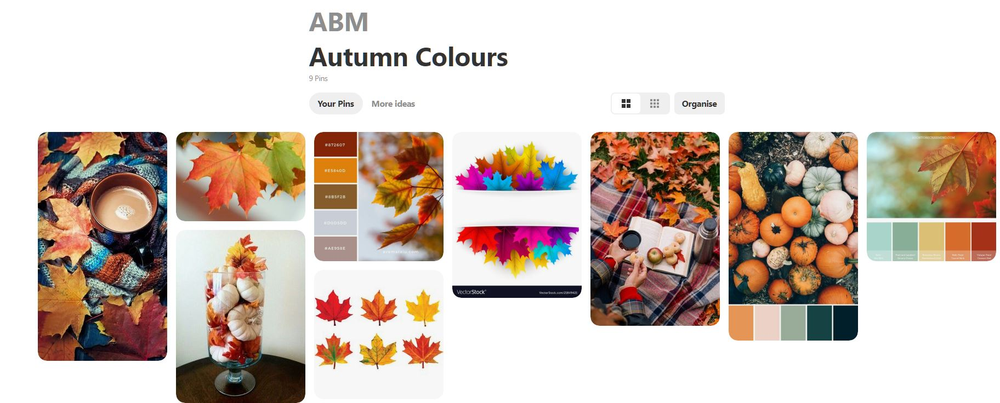

## Rails Marketplace: Aussie Beauty Market


Aussie Beauty Market (ABM) is a two-sided marketplace application on Rails that allows people to buy and sell second-hand makeups in Australia.

---
## Links

- __[R9] Live Website__: https://aussie-beauty-market.herokuapp.com/
- __[R10] GitHub Repo__: https://github.com/EllieChen-Git/Aussie-Beauty-Market

---

### Website Screenshots

- __Landing page__


- __All makeups__


- __New listing__


- __Edit listing__


- __Show listing (when user is the listing owner: s/he will see 'Edit', 'Delete' and 'Answer a question' buttons)__

.png)

- __Show listing (when users are NOT the listing owner: s/he will see 'Purchase' and 'Ask a question' buttons)__

.png)

- __User sign up__


- __User profile__


---

## [R7][R8] Problem Identification & Solution

In a consumer society, so many new products are launched every single day. Nowadays, many people own stuffs either they do not like anymore or they will not be using in the near future. Makeups are no exception! 

ABM is a two-sided marketplace application where people can trade second-hand makeups directly in Australia. It does not only serve as a second-hand marketplace, but also help us reduce the waste and protect the environment. This app was also created with an intention to build a platform for Aussies to find the products that suit their personal tastes based on the product information listed and the user profiles (skin type & bio - preferred makeup styles) provided on the website. 

Before starting this project, a market research was conducted on the existing websites. When it comes to selling used goods, the first thing comes to people's mind would be online classified advertisement websites like Gumtree, eBay and Amazon. However, these websites do not focus on makeups only and are not intended for building a beauty community. Therefore, the target audience would be different from ABM. 

Many social platforms also provide a similar functionality (i.e. online forums) for people to sell makeups. For example, there is a social group [Makeup Buy, Sell, Giveaway And Swap Australia And New Zealand](https://www.facebook.com/groups/894975940585690/) on Facebook. The drawbacks of this kind of marketplace on social medias is that people must have the social media accounts in order to use this service. As many people use Facebook to share their personal lives with their family and friends, there is sensitive personal information attached to their Facebook accounts. Many people like me would be hesitated to use Facebook groups to buy and sell goods as we are concerned that our personal information might be comprised without our acknowledgment.

There is another website called [Glambot](https://www.glambot.com/) on the market. However, this is not a direct two-sided marketplace as buyers and sellers cannot trade with each other directly. This website serves as a medium to firstly collect used makeups from sellers (they pay the sellers), and re-sell the products to buyers.

Therefore, ABM was specifically developed to solve the problems that the Australian beauty community is currently facing. 

---
## [R11] Project Description

### Purpose

The purpose of this marketplace application is to solve the problems faced by the Australian beauty community. It can also be used to demonstrate what I have learned about Ruby on Rails, HTML, CSS and SASS, and showcase my abilities in full stack web development. ABM serves as an example that I was able to plan, design, implement and deploy a two-sided E-commerce application, from a design brief, database implementation to a deployed website.


### Functionality / Features

__1. Responsive web design__

ABM suits devices in different screen sizes with the implementation of flexbox and media breakpoints of 600px and 900px.

```css
//Media query breakpoints
@media only screen and (min-width: 600px) {
    section {
        flex-direction: row;
    }
    section div {
        padding: 10px;
        padding-bottom: 30px;
        width: calc(50% - 20px);
    }
    .div-one, .div-two {
      padding-top: 40px;
    }
    .hero {
        display: block;
    }
  }
  @media only screen and (min-width: 900px) {
    section div {
        padding: 30px 10px;
        width: calc(33% - 20px);
    }
    header {
        padding: 10px 50px;
      }
  }
```

__2. User authentication (from Devise)__

- Users need to sign up for a password-protected account and log into their account in order to perform certain actions (e.g. create, edit, delete & purchase a listing, as well as ask a question and answer a question):

app\controllers\listings_controller.rb

```ruby
before_action :authenticate_user!, only: [:new, :create, :edit, :update, :destroy, :purchase]
```
app\controllers\answers_controller.rb
```ruby
before_action :authenticate_user!
```
app\controllers\questions_controller.rb
```ruby
before_action :authenticate_user!
```

- On the navigation bar, different Sign Up/Log In (if users have not signed in) and Log Out (if users have signed in) tabs will be shown depending on the user’s login status.


__3. [R4] User authorisation__

- Only the listing owner can edit and delete a listing and see the edit and delete buttons on the show listing page. Likewise, only the listing owner can answer the questions on the same page.

app\controllers\listings_controller.rb

```ruby
class ListingsController < ApplicationController
    before_action :set_user_listing, only: [:edit, :update, :destroy]

   private

    def set_user_listing
        @listing = current_user.listings.find_by_id(params[:id])

        if @listing == nil
            redirect_to listings_path
        end
    end
```
app\views\listings\show.html.erb

```html

    <!-- Only listing owner can see 'edit' & 'delete' buttons -->
    <% if user_signed_in? and @listing.user_id == current_user.id %>
    <div class="field">
      <%= button_to "Edit", edit_listing_path(@listing), method: :get %>
    </div>

    <div class="field">
      <%= button_to "Delete", listing_path(@listing), method: :delete, data: { confirm: "Are you sure?" }%>
    </div>
    <% end %>
```

- Only people other than the listing owner can see the purchase button on the show listing page. Likewise, only people other than the listing owner can ask the questions on the same page.

app\views\listings\show.html.erb

```html
    <!-- Only people other than listing owner can see 'purchase' button -->
    <% if user_signed_in? and @listing.user_id != current_user.id %>
    <div class="field">
        <%= button_to "Purchase",  purchase_listing_path(@listing.id), method: :get %>
    </div>
    <% end %>
```
app\views\listings\_questions_answers.html.erb

```html
<!-- Question form: Only people other than listing owner will see 'ask question' form -->
<% if user_signed_in? and @listing.user_id != current_user.id %>
    <div class="div-questions-answers">
      <%= form_with(model: @question, local: true) do |form| %>
          <div class="field">
            <%= form.label :body, "Ask a question:" %>
            <%= form.text_area :body %>
          </div>

          <div class="field hidden">
            <%= form.hidden_field :listing_id, value: @listing.id %>
          </div>

          <div class="field hidden">
            <%= form.hidden_field :user_id, value: @listing.user_id %>  
          </div>

          <div class="actions">
            <%= form.submit "Submit question"%>
          </div>
      <% end %>
    <% end %>
    </div>
```

__4. Purchase function__

- Users can make secured payment through Stripe.

__5. Q & A section__

- Before purchasing a makeup, users can check the Q & A section on the show listing page. They can also ask questions on the same page.


__6. Dynamic relationship between user profile and show listing__

- When signing up for an account, users are required to describe certain information like their skin type and preferred makeup styles on their user profile. 
- On the show listing page, users can click on the listing owner's username and see the profile with the above-mentioned information.
- The user profile page will list all the makeups belong to that user (with links to each listing s/he owns), so people can use this function to track the products owned by the users with the same skin types or similar makeup tastes.

__7. [O4] Searching capability__ 

- Two search functions are presented on the landing page and all makeups pages.
- With 'Simple Search', users can search listings by listing titles (this is a fuzzy search & case-insensitive search).
- With 'Advanced Search', users can search listings by brand keywords (fuzzy search & case-insensitive), dropdown category menu (face, eyes, lips and accessories) and price range (minimum and maximum prices). The 'Advanced Search' function is a CRUD resource.

__8. Other general features__

- ABM provides a simple 3-step explanation on how to use the site on the landing page.

- ABM only shows the available listings on the all makeup page. Once an item is purchased, it will no longer be shown to the users.

- Placeholders are provided for the social icon bar on the footer.

---

### Sitemap

The sitemap of the marketplace can also be viewed on GitHub: [Marketplace - Sitemap](https://github.com/EllieChen-Git/Aussie-Beauty-Market/blob/master/docs/sitemap.jpg)


---

### Target Audience
- People who would like to buy and sell second-hand makeups in Australia
- Potential employers and recruiting agencies
- People who are interested in my personal projects

---

### Tech Stack

- Programming Languages: Ruby on Rails, JavaScript, HTML, CSS, SASS
- Source Control: Git & GitHub
- Planning & Implementation: 1. Project management (Trello), 2. Mood board (Pinterest), 3. Wireframes (Balsamiq)
- Deployment Platform: Heroku 
- Payment Processing: Stripe
- Cloud Storage: AWS - S3
- Security: AWS - IAM

---

## [R16] Third-party Service

There are plenty of third-party services used in this application to streamline the development and deployment process, including Ruby/Rails gems, third-party APIs and third-party platforms:

### Ruby/Rails gems

- __[R3] Devise__ (https://rubygems.org/gems/devise): Devise is a flexible authentication solution for Rails based on Warden.

- __Faker__ (https://rubygems.org/gems/faker/versions/1.6.3): This gem is a port of Perl's Data::Faker library that generates fake data. It comes in very handy for taking screenshots, having real-looking test data, and having your database populated with more than one or two records while you're doing development.

- __Httparty__ (https://rubygems.org/gems/httparty): Makes http fun again! Ain't no party like a Httparty, because a Httparty don't stop. In order to randomly generate user locations in the seeds file, Httparty was used to incorporate with the Postcode API.

- __Normalize-rails__ (https://rubygems.org/gems/normalize-rails): Normalize.css is an alternative to CSS resets.

- __Down__ (https://rubygems.org/gems/down/versions/1.1.0): Robust file download from URL using open-uri.

- __Aws-sdk-s3__ (https://rubygems.org/gems/aws-sdk-s3/versions/1.0.0.rc2): Official AWS Ruby gem for Amazon Simple Storage Service (Amazon S3). This gem is part of the AWS SDK for Ruby.

- __Stripe__ (https://rubygems.org/gems/stripe/versions/1.57.1): Stripe is the easiest way to accept payments online. See https://stripe.com for details.

- __Ultrahook__ (https://rubygems.org/gems/ultrahook): Ultrahook lets you receive webhooks on localhost. It relays HTTP POST requests sent from a public endpoint (provided by the ultrahook.com service) to private endpoints accessible from your computer.


### [O2] Third-party API

- __Postcode API__ (https://postcodeapi.com.au/): Postcode API is a free service that allows anyone to easily lookup Australian suburbs and postcodes based on various criteria. This API was used to randomly generated users' locations.

### Third-party Platforms

- __[R6] Heroku__

This application was deployed on Heroku, a cloud-based Platform-as-a-Service, which manages server configuration, network management, database versioning and DNS management.

Heroku uses Puma as the web server, which is the one used in developing and testing ABM. With the URL provided by Heroku (which can also be customised to the domain name you like), users can access a live version of the app anytime.

Heroku runs the application inside a dyno by packaging all the source code of this application and all the dependencies. Dynos also provide the capability of scaling up this application in the future.

Lastly, Heroku offers different deployment methods to smooth the deployment process. I chose to connect my Heroku app with my GitHub repo, which means every time I made a git push, the files on my GitHub repo will be updated and the site deployed on Heroku will also be automatically synchronised.

- __[O1] Stripe__

Stripe is an online software platform, which specialising in payment processing. Stripe is a very powerful and flexible tool for e-commerce, as it also provides different types of payment methods, like one-off payment, recurring payment and subscription. ABM utilises Stripe as a secured way to process one-off payment.

When users click the purchase button on the listing page, they are firstly redirected to a payment confirmation page. On this page, users will be notified that they will be redirecting to a third-party payment system (Stripe) for secure payment processing and seek their confirmation to continue. Once they click the 'Continue' button, they are redirected to Stripe page to enter their credit card details. 

Once the payment goes through, users are redirected back to successful payment page of the application, where they will see the congratulation message, and they can choose to continue shopping by click the link provided, which will redirect them back to the all makeups page.

ABM does not handle payment and store sensitive payment data by itself. All payments go through Stripe, which invokes TLS encryption, PCI DSS and tokenisation. Stripe encrypts all the credit card numbers and holds their decryption keys on separate machines. Stripe also forces users to use HTTPS for secure connections. As a result, ABM only stores the purchase ID, listing ID and User ID in the database as a payment reference.

The Stripe payment processing also incorporates Webhooks. Once a payment is processed, Stripe uses webhooks to notify ABM that an event happens in ABM's account. 

- __[R5] AWS - S3__

Amazon Simple Storage Service (Amazon S3) is a cloud hosting service for any uploaded images. ABM uses AWS S3 Bucket to host images (pictures for user profiles and makeup listings) instead of storing files locally. In other words, the images on ABM have higher reliability (compared to using image links from the Internet) and mobility (compared to store image files locally) and it also provides the potential for better scalability in the future.

- __AWS - IAM__

ABM also uses 'AWS Identity and Access Management (AWS IAM)' to securely manage access to AWS services (in this case AWS S3). With AWS IAM, people can create and manage AWS users, and set up permissions to allow and deny their access to certain AWS resources. 

---
## Design Brief

### Colour Scheme

Colour palette for this site can also be found on Adobe Color: [Marketplace - Colour Palette](https://color.adobe.com/search?q=autumn)


### Mood board

Mood board for this site can also be found on Pinterest: [Marketplace - Mood Board](https://www.pinterest.com.au/elliechenetc/abm/)





---
### [R12] User Stories

•	As Ellie, I would like to browse the website on my mobile, computer and even my tablet.

•	As Ricky, I would like to sign up an account, so that I can start using certain functions provided by the site.

•	As Mark, I would like to log into my existing account.

•	As Wayne, I should be able to see all the makeup listings without logging in.

•	As Garret, I should be able to see the detailed information of a listing without logging in.

•	As Hamish, I would like to log out my account if I'm leaving the website.

•	As Tom, I would like to upload a picture for my user profile.

•	As Angel, I would like to view other users' profiles.

•	As Jurra, I would like to see the listings owned by the same user.

•	As Elliot, I would like to see the listing owner’s username on the listing page.

•	As Prad, I would like to only see the available items. (i.e. a listing will not be shown if it has been purchased by someone else).

•	As Alex, I would like to search a makeup with its name, brand, price, and category.

•	As Ragan, I would like to buy second-hand makeups.

•	As Dale, I would like the website to handle the payment function, so that I do not have to provide my account details to others.

•	As Blake, I would like to sell second-hand  makeups.

•	As Nina, I would like to create, update and even delete a makeup listing.

•	As Luke, I would like to upload a picture and provide information for my listing when I create a listing.

•	As Chelsea, I will not be able to edit or delete someone else’s listing.

•	As Cassie, I will not be able to purchase my own listing.

•	As Max, I would like to ask questions before my purchase.

•	As Harry, I will not be able to ask questions on my own listing.

•	As Robbie, I would like to answer questions regarding my listings from potential buyers.

•	As Niraj, I will not be able to answer questions on someone else’s listing.

---
### [R13] Wireframes

The completed wireframes (9 pages for 3 different screen sizes: desktop, tablet & mobile) in one single PDF can also be viewed on GitHub: [Marketplace - Wireframes](https://github.com/EllieChen-Git/Aussie-Beauty-Market/blob/master/docs/wireframes/Wireframes_ABM.pdf)

- __Wireframes - 1. Landing__

.png)

- __Wireframes - 2. Sign up__


.png)

- __Wireframes - 5. User Profile__


.png)

- __Wireframes - 6. All listings__


.png)

- __Wireframes - 7. New Listing__


.png)

- __Wireframes - 8. Show Listing__


.png)

- __Wireframes - 9. Edit Listing__

.png)

---
## [R20] Project Management & Timeline

Trello board is the project management tool used for ABM and it can be found here: [Marketplace - Project Management](https://trello.com/b/YCQRqyra/marketplace-abm)

- Trello screenshot on 26 Oct 2019


- Trello screenshot on 31 Oct 2019


- Trello screenshot on 05 Nov 2019


- Trello screenshot on 09 Nov 2019


Below are the detailed project timelines with tasks allocation:

__25-Oct | Day 1 Project Design__ 
- Project idea approved
- Completed wireframes (desktop & mobile)
- Drafted ERD
- Drafted README

__26-Oct | Day 2 Project Design & Research__ (refer to Trello screenshots)
- Updated README format
- Developed project plan
- Set up Trello board
- Completed wireframes (tablet)

__27-Oct | Day 3 Project Design & Research__ 
- Reviewed Rails concepts (database, Devise, Stripe)
- Created project development flow

__28-Oct | Day 4 Backend Coding & Database Testing__
- Set up database (80% - 'Purchases' table to do)
- Set up associations in Models
- Completed simple database testing in Rails console
- Completed seeds file

__29-Oct | Day 5 Backend Coding & Frontend Design__ 
- Scrapped the whole project & rebuilt it from scratch
- Decided colour scheme & tested 
- Completed moodboard (Pinterest)
- Decided fonts: 1 special font (Gochi Hand), 2 regular fonts (Roboto, Source Sans Pro)  
- Completed HTML/CSS layout planning
- Completed all routes

__30-Oct | Day 6 Backend Coding__
- Added Gem (simple_form, normalize-rails, down), but later decided not to use simple_form
- Modified views: user_signup
- Added views: landing page, show_listing, new_listing, form_partial

__31-Oct | Day 7 Backend Coding__ (refer to Trello screenshots)
- Completed views: new_listing (nested_attributes_for: location), edit_listing, show_listing (incl. ‘delete’ button)
- Added wireframe: edit_listing
- Completed Q&A section on show_listing: Q&A routes, Q&A controllers, Q&A form_partial

__01-Nov | Day 8 Backend Coding__ 
- Completed user_profile page (route, profiles controller, show_profile view)
- Added links to user profile on show_listing & added links to individual listing on show_profile page
 master
- Modified user_signup (added user image uploading function), user_login, user_forgot_password pages
- Whitelisted & validated params for all fields in new_listing, question, answer
- Added user images to seeds file

__02-Nov | Day 9 Backend Coding__ 
- Completed simple search form (fuzzy search, case insensitive) on landing, all_listings, show_listing pages by creating simple search form partial & search method on listing model
- Completed advanced search function (search: routes, controller, model, views)
- Completed AWS S3 & IAM set up and switched images storage from local to cloud
- Set up Stripe & Buy function on show_listing: install gems (stripe, ultrahook), payments (routes, controller, successful_payment view)

__03-Nov | Day 10 Frontend Coding__
- Initial front-end setup: Imported font awesome, google fonts
- Added footer (copyright, social icon bar)
- Added nav bar (with log in/sign up or logout dropdown - based on login status)

__04-Nov | Day 11 Frontend Coding__
- fixed white space issue above nav bar by moving nav_bar partial into application.html.erb [later caused another spacing issue when added hero image]
- added icons to login/signup/logout
- set up class on simple_search partial form & styled it
- landing_page: set up basic RWD design & added hero image
- created Purchase model & associations in listing & user models

__05-Nov | Day 12 Frontend Coding__ (refer to Trello screenshots)
- fixed purchase table issues: modified webhook route in stripe, started ultrahook, purchase (route, controller, view) 
- fixed nav bar - dropdown (z-index)
- fixed white space issues (nav bar & footer)
- changed footer to be RWD
- changed nav bar to be collapsible & RWD
- completed ERD with notation & sitemap
- styled all_listing page

__06-Nov | Day 13 Frontend Coding (Styling) & Documentation__
- implemented basic user authentication & authorisation
1. listings_controller: 
2. show_listing: only shows edit & delete buttons if user == owner
3. show_listing: only shows purchase button if listing hasn't been purchased
4. _questions_answer: only users != owner will see 'ask question' form 
5. _questions_answer: only users == owner will see 'answer question' form 
- styled new_listing, edit_listing (basic)
- modified wireframes & added screenshots

__07-Nov | Day 14 Frontend Coding (Styling) & Documentation__
- styled show_listing, questions_answer, purchase_listing
- slightly modified devise user views
- modified wireframes & added screenshots

__08-Nov | Day 15 Frontend Coding (Styling)/Documentation/Deployment__
- only available listings will be shown on all_listing page
- styled payment success page  (basic)
- completed Heroku deployment (changed background image tag to Rails way, added Heroku endpoint at stripe/webhook)
- styled user profile page (basic)
- styled show_adv_search/new_adv_search (basic)
- completed basic spelling check MVC & SCSS
- uploaded wireframes images

__09-Nov | Day 16 Debugging & Documentation__ (refer to Trello screenshots)
- arranged images and Q & A for presentation purpose
- turned on user authentication on view
- fixed issues: search bug
- added 'dependent: :destroy' to user-purchase, listing-purchase
- added alt tag to all the images, ran accessibility test
- modified textarea sizes & user bio default value
- worked on documentation 
- completed slides

__10-Nov | Day 17 Presentation Preparation & Final Check__
- completed documentation
- completed final spelling check
- completed presentation preparation 

---

## Database Planning & Structure

### R14 ERD

The sitemap of the marketplace can also be viewed on GitHub: [Marketplace - ERD](https://github.com/EllieChen-Git/Aussie-Beauty-Market/blob/master/docs/ERD.jpg)


### [R15] High-level Components (Abstractions)

Ruby on Rails uses the architecture of MVC patterns (Model-View-Controller) and follows the rule of 'convention over configuration'. In terms of the design principle, 'separation of concerns' is followed, so each component (model, view and controller) should only handle a specific set of actions for an application.

- __Models__: Model deals with the data storage in our Rails app. Rails uses Active Record in the model layer, which is responsible for creating and maintaining persistent data required for an application by interacting with the database. The beauty of using models on Rails is that we are not required to write the language of a database. Instead, we can write Ruby code on models to interact (i.e. create, update, delete) with all the data in our database.

- __Views__: View is how we interact with the user and the code placed in views is usually what the user can see on the website (e.g. webpages). Views take data instantiated by controllers and add styling to it before sending it to our web server, which will later pass the information to the user's browser. For example, if we want to explain something to the user or receive information from users, the code will be placed inside view. Our goal is to only present minimal logic in our view layer, which means that we will only place simple logic like 'control flow (e.g. if/else statement)' and loops in our views.

- __Controllers__: Controller is the glue that connects our models and views together and is also the place we store our business logic of our Rails app. We usually declare instance variables in our controllers and use them in our views to display information to users or use them in models to create certain methods. Our controllers communicate with both our view and model components.

Other basic architecture components in our Rails app are server, routes, assets: 

- __Server__: Our default server in Rails is Puma. A server allows a directory within our local machine (i.e. our computers) to be accessible by the Internet. 

- __Routes__: Routes are more like a traffic controller. Our server will read the routes.rb file and decide where we should send the http request to and what methods on our controller will be responsible. The routes are arranged in rails using RESTful API architecture.

- __Assets__: The assets are usually our JavaScript code, styling code (e.g. CSS, SASS) and other media files we used in our Rails app such as images.

Important high-level component outside Rails:

- __Database__: Database is actually not part of Rails, but it should definitely be included when we talk about high-level components in Rails app. Database is the place that we permanently store data (models are just an interface for us to communicate with database), compared to some other temporary data storing functions like sessions. Database is just like a spreadsheet with different tables, and data is stored in the rows and columns of the tables.


###  [R17] Projects Models & Relationships

The 7 models exited in ABM and their relationships are as follows:

__User Model - Stores user information__

```ruby
  has_many :listings, dependent: :destroy
  has_many :questions, dependent: :destroy
  has_many :purchases, dependent: :destroy
  has_one_attached :pic
```
-	The relationships between users with (1) listings, (2) questions and (3) purchases are the 'has many' relationships. Users hold the forging keys of (1) listings, (2) questions and (3) purchases. 
-	Users also have their user profile picture attached to active storage. 

__Listing Model - Stores details of each listing__

```ruby
  belongs_to :user
  belongs_to :location
  accepts_nested_attributes_for :location, reject_if: :all_blank, allow_destroy: true
  has_many :questions, dependent: :destroy
  has_one_attached :pic
  has_one :purchase, dependent: :destroy
```
-	Listings belong to (1) users and (2) locations, and listings also accept nested attributes for locations (suburbs, postcode and states).
-	Every listing can have many questions, and once a listing is deleted, the questions attached to it will also be removed.
-	Listing can only have one purchase, as every listing on ABM is a unique item. Once a listing is purchased, it is no longer available to other users.
-	Listings also have its listing picture attached to active storage.

__Question Model – Stores questions to a listing__

```ruby
  belongs_to :listing
  belongs_to :user
  has_one :answer, dependent: :destroy
```
-	Questions belong to (1) users and (2) listings.
-	Each question can only have one answer. Once a question is deleted, the answer attached to it will also be removed.

__Answer Model - Stores answers of questions__

```ruby
  belongs_to :question
```
-	Answers only belong to questions. I did not make answers belong to listings or users in order to maintain a simpler and cleaner database structure.

__Location Model – Stores details of listing locations__

```ruby
  has_many :listings, dependent: :destroy 
```
-	One location can have many listings as the location in ABM only includes attributes of suburbs, postcodes and states. 
- I did not want to add more detailed columns like street numbers or streets into the location table, as the locations are only used as an indication of the approximate geography locations of the listings (I did not want to show the detailed street address of each item on the page for the security purpose).
- Users can exchange more details addresses information for listing pick-up via private communication like email. 

__Purchase Model – Stores important purchase details__

```ruby
  belongs_to :user
  belongs_to :listing
```
-	Purchases belong to (1) users and (2) listings.
- purchases table only store non-sensitive payment data like user id, listing id and purchase id (from Stripe).

__Search Model – Stores advanced search results__ 

-	Searches table is not associated with any other tables. Every advanced search will be conducted independently without referring to fields in other tables.


###  [R18] Database Relations

ABM uses the PostgreSQL database for the persistent storage of data. Among the 9 tables, ABM utilises several types of relations: one and only one, polymorphic, zero or many, zero or one, many. 

Please also refer to the [R14] ERD above for the database relations diagram [ERD](#r14-erd).

__One and Only One__

- 'Answers to questions', 'questions to listings', 'questions to users', 'purchase to listings', 'purchases to users', 'listings to locations', 'listings to users'  ‘active storage attachment to active storage blobs’ are 'one and only one' relations. In other words, the former table belongs to the later table and the former tables hold the foreign keys to the later ones.

__Polymorphic__

- 'Users to active storage attachment' and 'listings to active storage attachment' are polymorphic relationships, as images for both user profiles and makeup listings are saved in the same active storage attachment table.

__Zero or Many__

- 'Users to questions', 'users to purchases', 'users to listings', 'listings to questions' are 'zero or many' relations, as the former can either have 0 or many of the latter.

__Zero or One__

- 'Questions to answers', 'listings to purchase' are 'zero or one' relations. One question can only have one answer, and one listing can only be purchased once.

__Many__

- 'Locations to listings': 'Locations to listings' is a 'many' relation. The same location can have several listings, but will not have zero listing as the location fields are mandatory when creating a new listing.


###  [R19] Database Schema Design

ABM uses PostgreSQL as the database and the data is stored in columns and rows of several tables. The relationship between tables and field types is called a schema. The complete schema code can also be found on [Schema.rb](https://github.com/EllieChen-Git/Aussie-Beauty-Market/blob/master/db/schema.rb)

Please also refer to the [R14] ERD above for the database schema diagram [ERD](#r14-erd).

Below is a brief explanation on ABM’s database schema design:

- Tables 'users' and 'listings' are the two major tables of ABM. The rest of the tables are linked at least one of them. ‘Searches’ table is the only exception.  

I intentionally kept all the users in one single table, instead of dividing them into buyers and sellers, as all the users share the same data fields (e.g. username, email etc). The ‘identity’ of a user is changeable, and a user can be both a buyer and a seller at the same time. User authentication was implemented in listing controller and views to separate their actions (1. Edit, Delete and Purchase a makeup listing, 2. Ask a question or Answer a question)

- Tables 'active_storage_attachments' and 'active_storage_blobs' are automatically created when installing active storage. 

Active storage is a polymorphic table to store user profile images and makeup listing images. On 'active_storage_attachments', we can see which image is belong to which record type (User/Listing). 'Active_storage_blobs' is only connected to 'active_storage_attachments' are used to store metadata of the images.

- Table 'purchases' is linked to 'users' and 'listings' and is used to store important and non-sensitive payment data (sensitive payment data like credit card details are handled by Stripe).

- Tables 'locations' has many 'listings. 

I intentionally created the relationship existed between locations and listings, instead of between locations and users. I believe that users should be able to post listings in different locations. For example, users might be posting makeups for their families and friends, whom are not necessarily living in the same suburbs as themselves.

- Tables 'questions' and 'answers' are designed for the Q & A section on the listing pages. 

I tried to simplify the relationships between 'questions' and 'answers' to avoid duplicate data entries, so answers are only linked to 'question_id' and are not linked to 'user_id' or 'listing_id'. 

- Table 'searches' (for advanced search function only) is independent of all the other tables 

Table 'searches' is used to store the advanced search results. The data in the 'searches'  table will be cleaned regularly to avoid accumulation of data storing here permanently.

---
## Future Improvements

- Improved website styling
- Added 3rd party services: Mailgun - transaction email (https://github.com/mailgun/mailgun-ruby)
- Added Review function: buyers and sellers can rate and review each other on the transactions completed

Copyright © 2019 Ellie Chen. All Rights Reserved.
